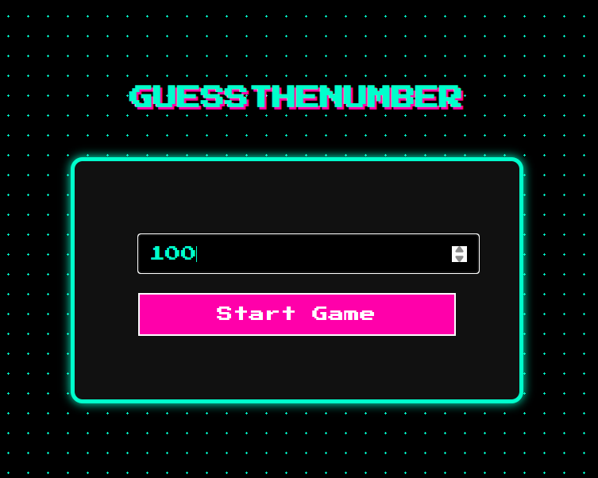

#  Arcade-Style Number Guessing Game

Welcome to a fun, retro-inspired number guessing game!  
This project combines a **pixel-art-style frontend** with a **Spring Boot backend** to deliver an arcade experience right in your browser.

---

##  Features

-  Typewriter-style animated title on load
-  Pixel-art arcade UI with glowing buttons and fonts
-  Start by setting a number range
-  Backend picks a random number and limits your guesses (log₂ of range)
-  Tells you if your guess is too high or too low
-  Shows "Game Over" with the correct answer if you run out of guesses
-  Easy Restart without refreshing the page

---

##  How to Run

###  Backend (Spring Boot)
1. Open the project in your IDE (IntelliJ, VS Code, Eclipse).
2. Run the `GameController.java` file.
3. Server will run on: `http://localhost:8080`

###  Frontend
1. Open `index.html` in your browser (double-click or serve via live server).
2. Interact with the game!

> Make sure the frontend is allowed to call `http://localhost:8080` (CORS is already enabled in the controller).

---

##  Technologies Used

-  HTML, CSS, JavaScript (Arcade UI)
-  Java 17+
-  Spring Boot (REST API)
-  Math-based guess limit logic

---

## Screenshots

 
---

##  License

This project is open-source under the [MIT License](LICENSE).
